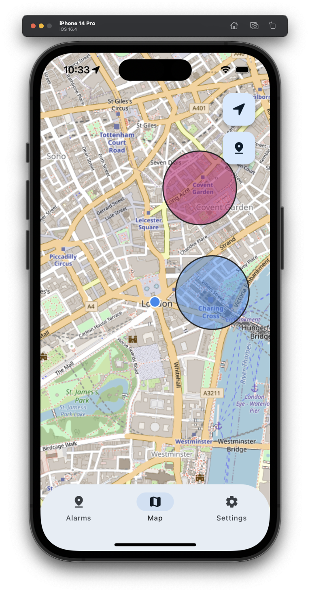
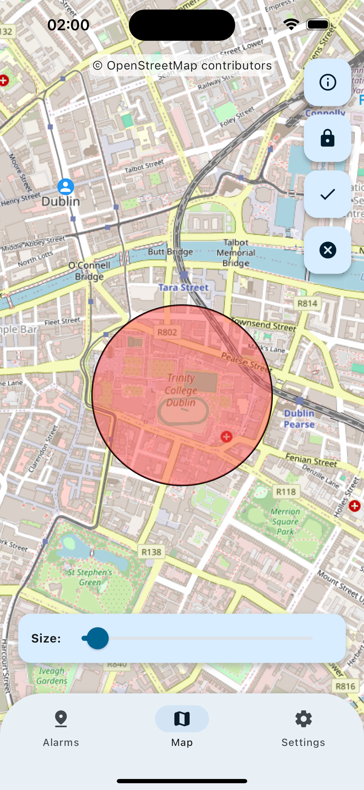
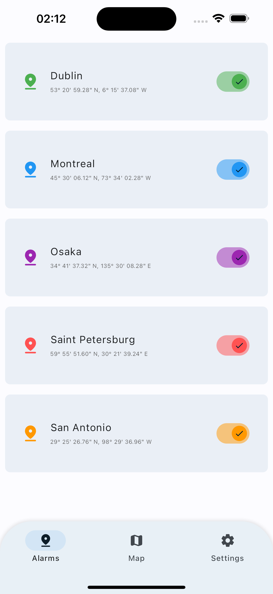
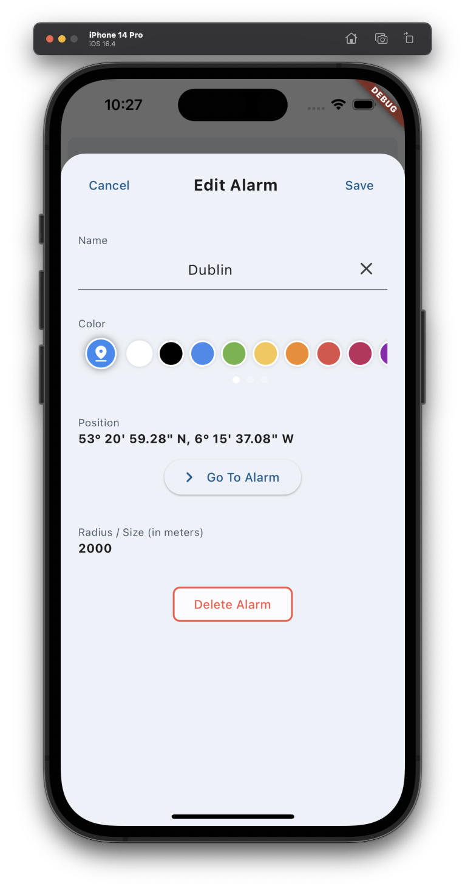
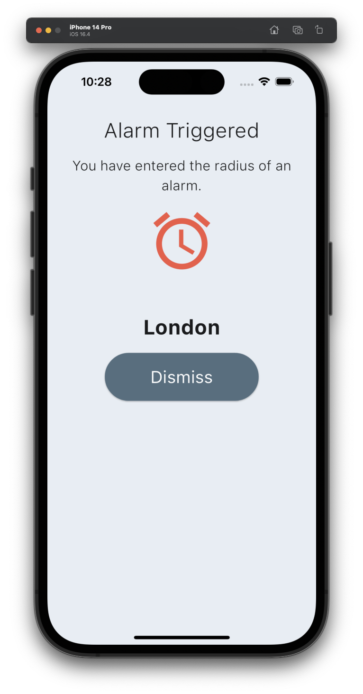

# Location Alarm

A poximity based alarm mobile app for travel. Set alarms at desired locations to never miss a train stop or attraction.
Built in Flutter using geolocation, mapping, notification, and storage libraries.

